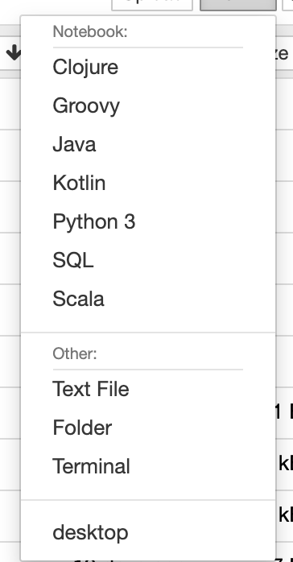

Use ImageJ in Python
====================

Description:
------------

This section shows how to use ImageJ as a Python library to analyze data in OMERO.

Using the Python API allows us to easily load the 2D-plane we need to see or analyze.
This is much easier that when using the Java API and Bio-Formats plugin.

We will show in the notebooks:

- How to start ImageJ in Python.

- How to load data from OMERO.

- How to run ImageJ macro from Python.

Setup
-----

For using the Python examples and notebooks of this guide we recommend using Conda (Option 1).
Conda manages programming environments in a manner similar to 
`virtualenv <https://virtualenv.pypa.io/en/stable/>`_.

Alternatively you can use ``repo2docker`` to build and run a Docker image locally (Option 2).
This Docker image will provide the Conda environment and Jupyter notebooks with some image 
analysis workflows.

*Option 1*
~~~~~~~~~~

Install omero-py and `pyimagej <https://pypi.org/project/pyimagej/>`_ via Conda:

- Install `Miniconda <https://docs.conda.io/en/latest/miniconda.html>`_ if necessary.

- Create a programming environment using Conda and activate it::

    $ conda create -n imagej_python python=3.6

    $ conda activate imagej_python

- Install omero-py and `pyimagej <https://pypi.org/project/pyimagej/>`_::

    $ conda install -c conda-forge pyimagej

    $ conda install -c ome omero-py

*Option 2*
~~~~~~~~~~

Create a local Docker Image using ``repo2docker``, see :download:`README.md <https://github.com/ome/omero-guide-fiji/blob/master/README.md>`::

    $ pip install jupyter-repo2docker
    $ git clone https://github.com/ome/omero-guide-fiji.git
    $ cd omero-guide-fiji
    $ repo2docker .

When the Image is ready:

- Copy the URL displayed in the terminal in your favorite browser

- Click the ``New`` button on the right-hand side of the window

- Select ``Terminal`` 

    \ |image0|

- A Terminal will open in a new Tab

- A Conda environment has already been created when the Docker Image was built

- To list all the Conda environments, run::

    $ conda env list

- The environment with the OMERO Python bindings and a few other libraries is named ``notebook``, activate it::

    $ conda activate notebook

Step-by-Step
------------

The script used in this document is :download:`run_macro_python.py <../scripts/python/run_macro_python.py>`.
One of the advantage of this approach is that we can load only the 2D-planes we wish to analyze.

In this example, Fiji has been installed locally. It is possible to install Fiji "on the fly",
see `ImageJ Tutorials <https://nbviewer.jupyter.org/github/imagej/tutorials/blob/master/notebooks/ImageJ-Tutorials-and-Demo.ipynb>`_ for more options.

If you do not use any ImageJ1 features e.g. macro, you do **not** need the UI environment and do **not** need to set the `headless` parameter (default is `True`).

Modules and methods which need to be imported:

.. literalinclude:: ../scripts/python/run_macro_python.py
    :start-after: # Imports
    :end-before: # Step 1

Load Fiji. If you run the script locally, point to your local installation of Fiji or load Fiji "on the fly". To run the macro, we use ImageJ1 graphical user interface (GUI) elements, and thus it requires using ImageJ in GUI mode. In this GUI mode, the resulting windows content is handled. This is the reason for the parameter `headless` to be set to `False`.
If you are running the example in the Docker container, 
you will also need to start UI environment if it is not already up.
If you have used the option 2 above, select ``desktop`` to start the UI environment:

.. literalinclude:: ../scripts/python/run_macro_python.py
    :start-after: # Step 1
    :end-before: # Step 2

Connect to the server. It is also important to close the connection again
to clear up potential resources held on the server. This is done in the 
``disconnect`` method:

.. literalinclude:: ../scripts/python/run_macro_python.py
    :start-after: # Step 2
    :end-before: # Step 4

Load an image from IDR:

.. literalinclude:: ../scripts/python/run_macro_python.py
    :start-after: # Step 3
    :end-before: # -

Load the binary plane as numpy array:

.. literalinclude:: ../scripts/python/run_macro_python.py
    :start-after: # Step 4
    :end-before: # Step 5

To be used in ImageJ, the numpy array will be converted into ImageJ types using the `to_java()` method.
In order the use the methods implemented above in a proper standalone script:
Wrap it all up in an ``analyse`` method and call it from ``main``:

.. literalinclude:: ../scripts/python/run_macro_python.py
    :start-after: # Step 5

