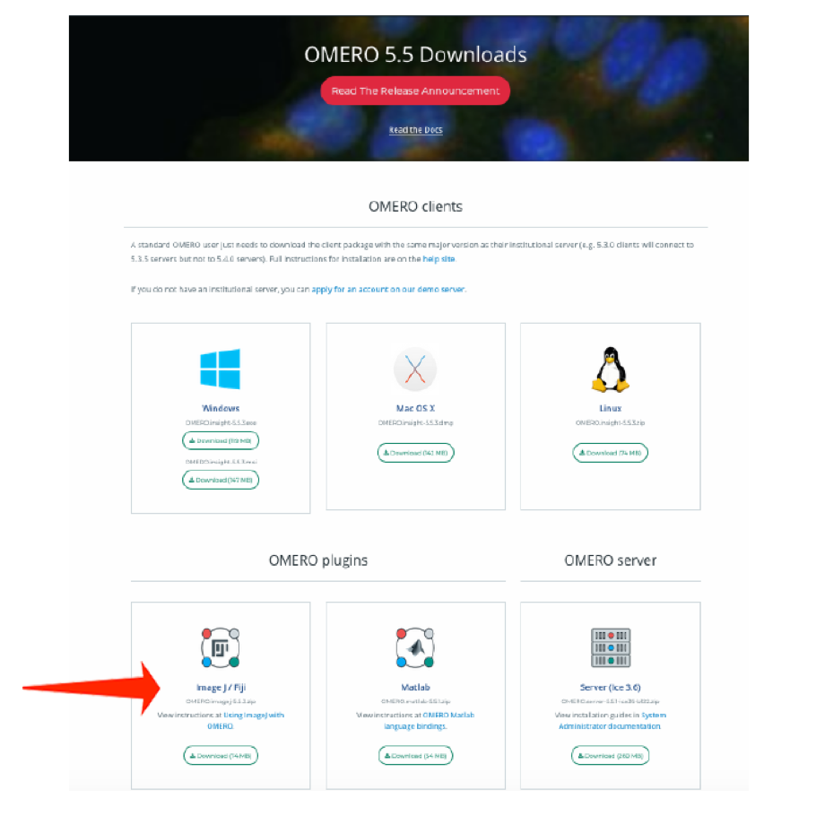
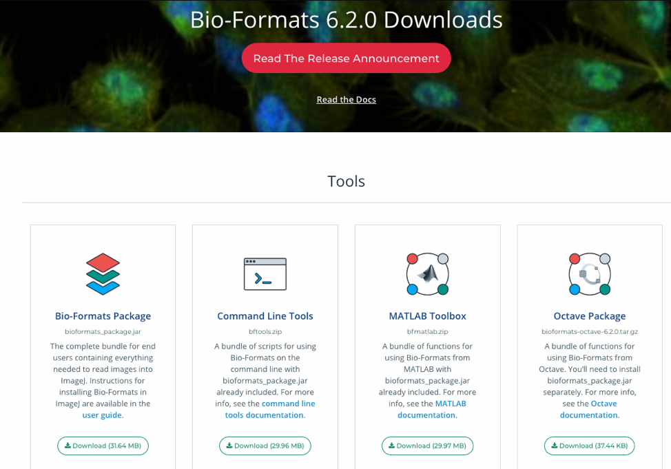

How to install the OMERO plugin for Fiji/ImageJ
===============================================

Description
-----------

`Fiji <https://imagej.net/Fiji>`__ is a free open-source image processing package based on
ImageJ. The following workflow shows how to
install the OMERO plugin for Fiji and ImageJ.

The OMERO plugin does not have an update site yet.

Setup step-by-step
------------------

We assume that you have already Fiji/ImageJ installed locally.

In this section, we will cover the steps required to install the
OMERO plugin for Fiji. If you wish to install it for ImageJ,
an additional step is needed.

We first describe the common installation steps for ImageJ and Fiji.
We then describe how to install the *Bio-Formats Package* for ImageJ.

Installing the OMERO plugin in Fiji also adds the dependencies
required to connect to OMERO using the Script Editor of Fiji.

Installation of the OMERO plugin for Fiji and ImageJ, the
common steps:

-  Find the Plugins folder of your Fiji application and check if it contains any old omero_ij-5.x.x-all.jar file(s) or OMERO.imagej-5.x.x folder(s). Remove any such jar files or folders from the Plugins folder.

-  Download from \ https://www.openmicroscopy.org/omero/downloads \
   the latest 5.x.x version of ImageJ/Fiji plugin for OMERO

-  For recent plugin versions (5.5.7 and higher): Note where you downloaded the omero_ij-5.x.x-all.jar file. Copy that file into the *plugins* folder of Fiji.

-  For plugin versions lower than 5.5.7: Extract the downloaded .zip archive. Remember where you extracted it to.

-  For plugin versions lower than 5.5.7: Copy the extracted folder and paste it to the *plugins* folder of Fiji.

-  **Note:** For plugin versions lower than 5.5.7: Some Windows unzip apps create a double folder enclosing the plugin. If that is the case, copy the inner OMERO.imagej-5.x.x folder into *Fiji.app > plugins* folder.

-  Now, restart Fiji. If you are using ImageJ, follow with the additional step below.

**Installation of Bio-Formats Package, ImageJ only:**

-  Download the latest version of the *Bio-Formats Package* from:
   https://www.openmicroscopy.org/bio-formats/downloads

-  Move the downloaded file into the *ImageJ > plugins* folder.

-  Restart ImageJ.

**Installation of the plugins required to use the ImageJ marco language to interact with OMERO**

The plugins are developed and supported by `Institute of genetics, reproduction & development iGReD) <https://www.igred.fr/en/institute-of-genetics-reproduction-development/>`__ in Clermont-Ferrand (France).

- Download the latest version of *simple-omero-client* from https://github.com/GReD-Clermont/simple-omero-client:

   - Click on the ``Tags`` tab
   - Click on the most recent tag
   - Download the ``simple-omero-client-<tag>.jar`` file e.g. ``simple-omero-client-5.12.1.jar``

- Download the latest version of *omero_macro-extensions* from https://github.com/GReD-Clermont/omero_macro-extensions:

   - Click on the ``Tags`` tab
   - Click on the most recent tag
   - Download the ``omero_macro-extensions-<tag>.jar`` file e.g. ``omero_macro-extensions-1.3.2.jar``

-  Move the downloaded jars into the *Fiji > plugins* folder.

-  Restart Fiji.

