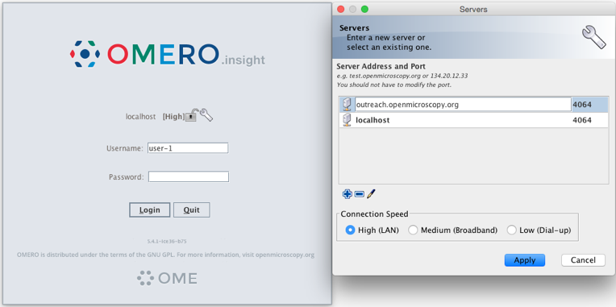
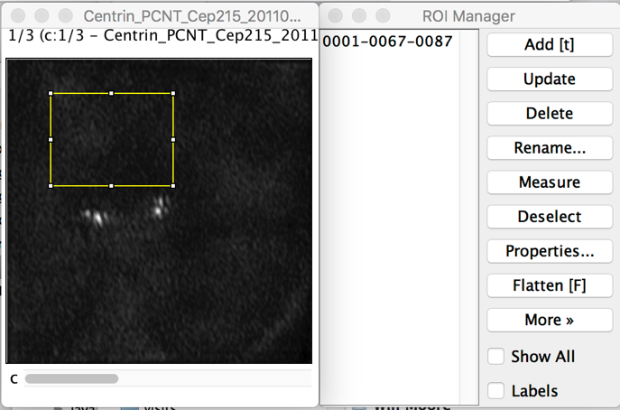
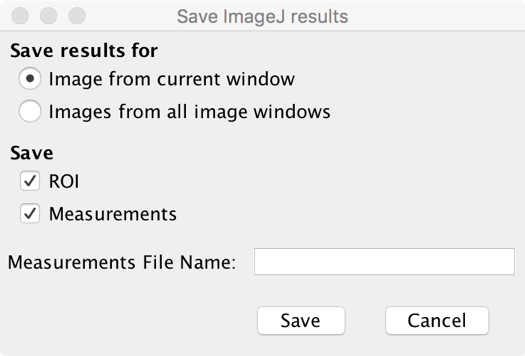
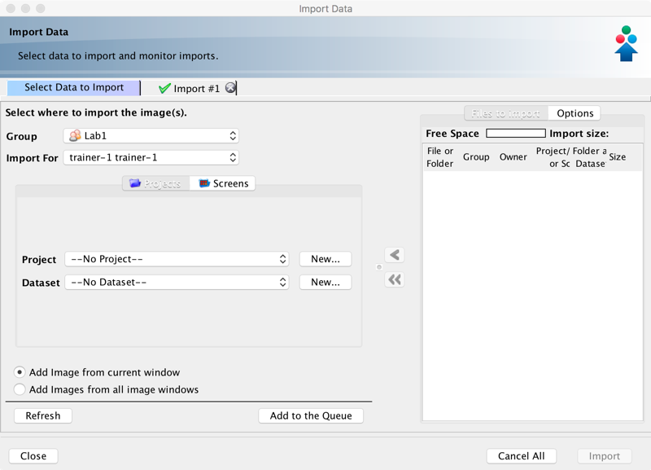
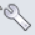

Analyze manually OMERO data using the OMERO plugin for Fiji/ImageJ
==================================================================

**Description:**
----------------

The following workflows should work
both with ImageJ and Fiji, after these have been correctly set up with
the OMERO plugin for Fiji/ImageJ.

Using the User Interface of the OMERO plugin, we will show:

-  How to connect to OMERO using the OMERO plugin for ImageJ/Fiji.

-  How to open an image from OMERO.server into Fiji/ImageJ.

-  How to manually save ROIs and measurements as CSV back to the
   original image in OMERO.server.

-  How to import a newly created image from Fiji/ImageJ into OMERO.

**Setup:**
----------

-  Install Fiji on the local machine with the OMERO.insight-ij plugin.
   The installation instructions can be found at :doc:`installation`.

**Resources:**

-  Samples images from the Image Data Resource (IDR) \ https://idr.openmicroscopy.org/webclient/?show=project-51\ .

..

**Step-by-step:**
-----------------

**Example 1: ROIs and measurement creation**
~~~~~~~~~~~~~~~~~~~~~~~~~~~~~~~~~~~~~~~~~~~~

In this first example we show how to open an OMERO image in Fiji, draw ROIs, measure those ROIs and show how to save the ROIs and the measurement back to OMERO. 

1. Launch Fiji/ImageJ.

2. Go to *Plugins > OMERO > Connect* To OMERO. This will show a login
   screen where you can enter the name of the server to connect to,
   the username and password. The OMERO plugin will allow you to
   browse your data in a similar manner to OMERO.web.

3. In the OMERO login dialog, click the wrench icon\ |image1| and then
   add the server address in the dialog. By default, only "localhost"
   is listed. Click on the *plus* icon to add a new line to the list
   and type into the line the server address.

4. Click Apply.

5.  Enter your credentials and click *Login*.

6.  Select the **A-Fiji-dataset** Dataset.

7.  Double-click on a thumbnail or on an Image in the left-hand tree to
    open an Image in ImageJ.

8.  Go to *Analyze > Tools > ROI Manager...*

9.  Draw a shape using for example the Freehand selection tool.

10. In the ROI manager, click the button *Add [t]* to add the shape to the
    ROI Manager.

11. Move to another channel, using the *c slider*.

12. Draw other shapes if desired. Add drawing a shape. Click *Add [t]* to
    add it to the Manager.

13. When done with the drawing, click the button *Measure* in the ROI Manager.

14. A dialog with measurements for each shape pops up.

15. To save the ROI and the measurement back to OMERO,
    go to *Plugins > OMERO > Save ROIs To OMERO*.

16. In the dialog popping up, under the *Save* section select ROI and Measurements.

17. The measurements are saved back to OMERO as a CSV file and linked to
    the Image.

18. Go back to OMERO.web, in the right-hand panel.

19. Select the image opened in Fiji/ImageJ.

20. Check that there is a new CSV file under the Attachments harmonica.

21. Open the image in OMERO.iviewer to the see the ROIs and make sure
    that you can interact with them.

**Example 2: Cropping and import**
~~~~~~~~~~~~~~~~~~~~~~~~~~~~~~~~~~

In this example, we show how to open an OMERO image, crop the image and
import the cropped image back to OMERO as OME-TIFF.

In this example we assume that the user is already logged in. If this is
not the case, go back to the first step of Example 1.

1. Select the *A-Fiji-dataset* Dataset.

2. Double-click on a thumbnail or on an Image in the left-hand tree to
   open an Image in Fiji/ImageJ.

3. Draw a Rectangle on the Image.

4. Select the option *Image > Crop*.

5. A new Image will be displayed in a Fiji/ImageJ window.

6. Go to *Plugins > OMERO > Save Image(s) To OMERO*.

7. An Import dialog (specific to the OMERO Fiji/ImageJ plugin) will pop up.

8.  Check that the option *Add Image from current window* is selected

9.  Select where to import the cropped Image e.g. **A-Fiji-dataset** Dataset.

10. Click *Add to the Queue* button.

11. Then click *Import*. The import will start.

12. When the import is done, go back to the Tree view in the Fiji plugin
    or OMERO.web. Refresh. Check the new Image.

