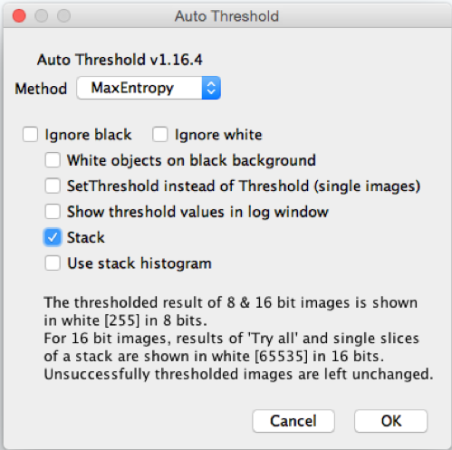
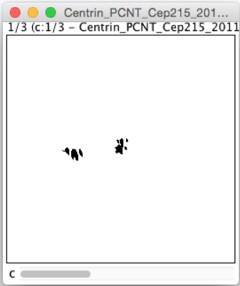
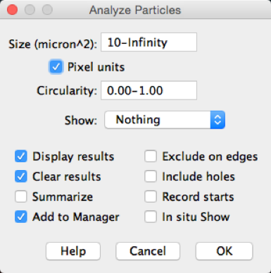

Segment manually OMERO data using Fiji/ImageJ
=============================================

**Description:**
----------------

The following workflows should work both with ImageJ and Fiji,
after these have been correctly set up with
the OMERO plugin for Fiji/ImageJ.

Using the User Interface of the OMERO plugin, we will show:

-  How to connect to OMERO using the OMERO plugin for Fiji/ImageJ.

-  How to open an image from OMERO.server into Fiji/ImageJ.

-  How to manually segment an image opened from OMERO in Fiji/ImageJ
   using the plugin *Thresholding and Analyze particles* in Fiji/ImageJ.

-  How to record this workflow in Fiji/ImageJ, using the *Recorder* plugin, for later use.

**Setup:**
----------

-  Fiji has been installed on the local machine with the
   OMERO.insight-ij plugin. The installation instructions can be
   found at :doc:`installation`.

**Resources:**

-  Samples images from the Image Data Resource (IDR) \ https://idr.openmicroscopy.org/webclient/?show=project-51

**Step-by-step:**
-----------------

#. Launch Fiji/ImageJ.

#. Go to *Plugins > OMERO > Connect* To OMERO. This will show a login
   screen where you can enter the name of the server to connect to,
   the username and password. The OMERO plugin will allow you to
   browse your data in a similar manner to OMERO.web.

#. In the OMERO login dialog, click the wrench icon\ |image0| and then
   add the server address in the dialog. By default, only "localhost"
   is listed. Click on the *plus* icon to add a new line to the list
   and type into the line the server address.

#. Click Apply.

   .. image:: images/manual2.png

#. Enter your credentials and click *Login*.

#. Browse to the Project **idr0021**, open any Dataset and double-click once
   on an Image to open it in Fiji. Bio-Formats is used to view the
   Image.

   - Make sure to select *View stack with: Hyperstack* in the *Bio-Formats
     Import Options* dialog.

   - Note that each plane will be transferred from the server to the
     client machine so this may take a few moments.

#. To open the Recorder, go *Plugins > Macros > Record...*, select
   Macros to record the actions. The steps will then be used in
   the Scripting workflow.

#. Convert floating-point pixel-type to 8-bit using *Image > Type > 8-bit*.

#. Go to *Image > Adjust > Auto Threshold*, to open the *Auto Threshold* dialog:

   - Select *MaxEntropy* for the *Method* parameter.

   - Check the checkbox *Stack*.

   ..

   |image2|\ |image3|

#. Click *OK*.

#. Then open *Analyze > Analyze Particles...*.

#. In the dialog

    - Set *Size* to *10-Infinity* and check *Pixel units*.

    - Check the following checkboxes:

       i.   *Display results*

       ii.  *Clear results*

       iii. *Add to Manager*

    - Click *OK* then *Yes* in the popup dialog indicating asking to
       *Process all X images?*.

   ..

   |image4|

#. To save the thresholded Image back to OMERO with the generated ROIs and the measurements:

    -  Select *Plugins > OMERO > Save Image(s) to OMERO*.

    -  Create a New Dataset for the image

       i.   Click the *New...* button next to the selection box on the
            Dataset row.

       ii.  In the dialog that pops up, enter a name and a description
            (optional).

       iii. Click Create.

    -  The newly created Dataset will automatically be selected.

    -  Click *Add to the Queue* then *Import*.

    -  Go to OMERO.web and check that the measurements have been saved
       in a CSV file and attached to the Images. The attachment can
       then be downloaded at any time.

.. |image0| image:: images/manual1.png
   :width: 0.24105in
   :height: 0.24105in

