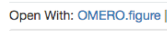
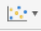
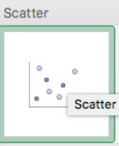

Segment OMERO data using the Scripting editor in Fiji
=====================================================

**Description:**
----------------

The following workflows should work in
Fiji, after these have been correctly set up with the OMERO plugin for
Fiji/ImageJ.

Using the Scripting editor of Fiji, we will show:

-  How to connect to OMERO using the JAVA API.

-  How to load all the images within a given Dataset.

-  How to load the images in ImageJ using Bio-Formats.

-  How to analyze the images using *Thresholding and Analyze Particles*
   plugin in ImageJ within a script.

-  How to save the segmented ROIs as polygons in OMERO.

-  How to collect the measurement associated to the ROIs and

   -  Save them as an OMERO.table and link the table to the Dataset.

   -  Save them as a CSV file and link it to the Dataset.

**Setup:**
----------

-  Install Fiji on the local machine with the OMERO.insight-ij plugin.
   The installation instructions can be found at :doc:`installation`.

**Resources:**

-  Data: Samples images from the Image Data Resource (IDR) \ https://idr.openmicroscopy.org/webclient/?show=project-51

-  Java API documentation: \ https://docs.openmicroscopy.org/latest/omero/developers/Java.html

-  Script: Groovy script for automatic segmentation of images from OMERO using Fiji
   -  https://raw.githubusercontent.com/ome/training-scripts/master/practical/groovy/analyse_dataset_save_rois_and_summary_table.groovy

**Step-by-Step**
----------------

We will now repeat the manual analysis :doc:`threshold_manual` on a
Dataset using the scripting facility available in Fiji.

Let’s go over the script to understand the logic and see how it matches
the UI steps.

This script explores the JAVA API using Groovy.
See \ https://docs.openmicroscopy.org/latest/omero/developers/Java.html\ .

It will process all the Images in the specified Dataset,
applying threshold, analyzing particles and saving ROIs back in
OMERO i.e. we reproduce in a script the manual steps recorded.
Further, it will create a CSV and OMERO.table to be attached to
that Dataset in OMERO.

#. In your browser, go to the server address provided.

#. Log in using the credentials provided.

#. Make sure you are selecting your own data. Select the Dataset **A-Fiji-dataset**.

#. Launch Fiji.

#. Go to *File > New > Script...*.

#. A dialog pops up. In the *Language* menu, select *Groovy*.

#. Copy, into the text script editor of Fiji, the content of the script \ https://raw.githubusercontent.com/ome/training-scripts/master/practical/groovy/analyse_dataset_save_rois_and_summary_table.groovy\.

#. You will be asked to enter your login credentials when you run the script.

#. Click *Run*.

#. Return to OMERO.web and open an Image from this Dataset in OMERO.iviewer.

#. Click the *ROIs* tab to see the added ROIs. Note that the ROIs have been assigned a Channel index to indicate which Channel they were derived from.

#. In the *Settings* tab, turning channels on/off will also show/hide
   ROIs assigned to those channels.

#. Open the image in OMERO.figure for a quick publication by going to
   Info tab in iviewer and clicking on OMERO.figure in the Open with
   line.\ |image1|

#. The script at https://github.com/ome/training-scripts/blob/master/practical/groovy/idr0021.groovy
   was used previously to run on the whole **idr0021** Project
   and produce the resulting CSV file. We can now download this file
   from OMERO and open it in Microsoft Excel.

#. In Excel, select the Dataset column and the column bounding_box and
   then click on *Insert > X Y Scatter > Scatter*\ |image2|\.
   Depending on the version of Excel you are using, this option
   might not be available.

   ..

   |image3|

17. This will create a scatter plot. Right-click into the Chart now and
    select *Change chart type > Statistical > Box and Whisker*.

